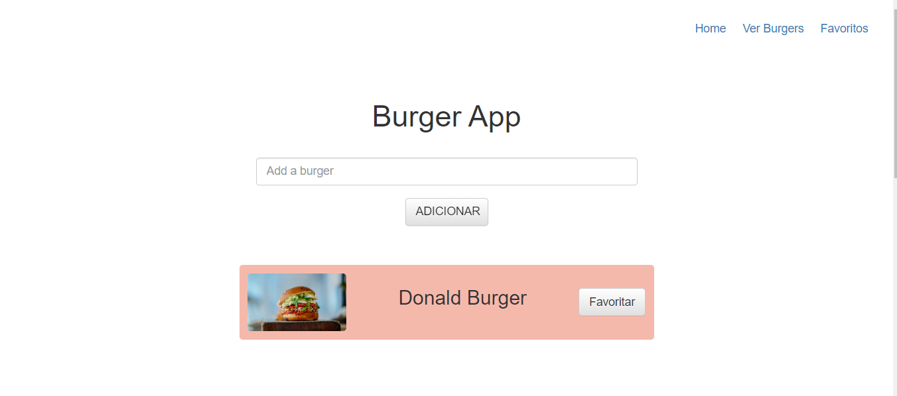
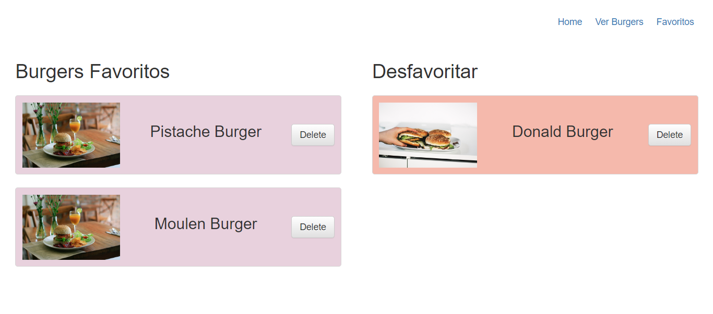
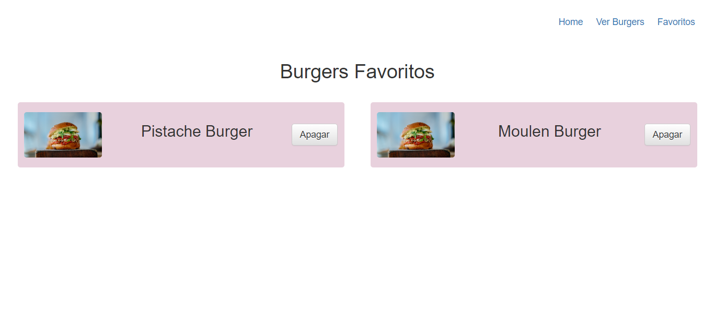
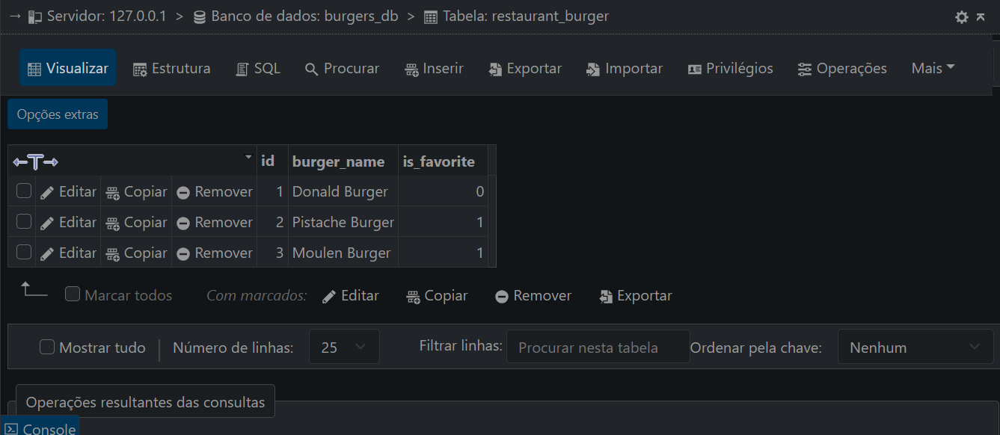

# BURGUER APP
👨‍🏫PROJETO CRIADO PARA O CURSO DE HANDLEBARS!

 <br> 
 <br> 
 <br> 
 <br> 

## DESCRIÇÃO:
O **Burger App** é uma aplicação web desenvolvida para gerenciar uma lista de hambúrgueres. Os usuários podem adicionar novos hambúrgueres, marcar seus favoritos, ver todos os hambúrgueres cadastrados e excluir aqueles que não desejam mais na lista. A aplicação utiliza Node.js e Express para o backend, Handlebars para templates no frontend e MySQL para o banco de dados.

## FUNCIONALIDADES:
1. **Visualizar Hambúrgueres**: Veja todos os hambúrgueres cadastrados ou apenas os favoritos.
2. **Adicionar Hambúrgueres**: Adicione novos hambúrgueres à lista.
3. **Favoritar Hambúrgueres**: Marque hambúrgueres como favoritos.
4. **Deletar Hambúrgueres**: Remova hambúrgueres da lista.

## ESSE APP É UM CRUD?
Sim, o **Burger App** é um exemplo clássico de uma aplicação CRUD, que permite a manipulação de dados de hambúrgueres. CRUD é um acrônimo para as quatro operações básicas que podem ser realizadas em uma aplicação de gerenciamento de dados:

1. **Create (Criar)**: Adicionar novos hambúrgueres ao banco de dados.
2. **Read (Ler)**: Recuperar e exibir hambúrgueres do banco de dados.
3. **Update (Atualizar)**: Atualizar informações de hambúrgueres existentes, como marcar como favorito.
4. **Delete (Deletar)**: Remover hambúrgueres do banco de dados.

## EXECUTANDO O PROJETO:
1. **Configuração do Banco de Dados:**
   - Antes de executar o site, é necessário importar o arquivo `./DATABASE/DATABASE.sql` para criar a estrutura inicial do banco de dados.

2. **Configuração do MySQL:**
   - Abra o arquivo `./CODIGO/config/connection.js` e ajuste as configurações do banco de dados de acordo com suas credenciais:
     ```javascript
      host: 'localhost',
      user: 'seu_usuario',
      password: 'sua_senha',
      database: 'burgers_db'
     ```
   Certifique-se de fornecer as credenciais corretas para que o aplicativo possa se conectar ao banco de dados MySQL corretamente.

3. **Instalando as dependências:**
   - Antes de executar o aplicativo, certifique-se de instalar todas as dependências necessárias. No terminal, execute o seguinte comando para instalar as dependências listadas no arquivo `package-lock.json`:
   ```bash
   npm install
   ```
   - Isso instruirá o pip a ler o arquivo `package-lock.json` e instalar todas as dependências listadas.

4. **Executando o Aplicativo:**
   - Após instalar as dependências, para iniciar o servidor, navegue até o diretório `CODIGO` no terminal.
   - Em seguida, execute o seguinte comando:
   ```bash
   node server.js
   ```
   - Uma vez que o servidor esteja em execução, você poderá acessar o aplicativo através do seu navegador, visitando o seguinte endereço: [http://localhost:9001/](http://localhost:9001/).
   
5. **Interagindo com o Aplicativo:**
   1. **Navegue entre as páginas:**
      - **Página Inicial**: Mostra todos os hambúrgueres que não são favoritos.
      - **Favoritos**: Mostra todos os hambúrgueres marcados como favoritos.
      - **Todos os Hambúrgueres**: Mostra todos os hambúrgueres cadastrados no sistema.

   2. **Adicionar Hambúrguer:**
      - Utilize o formulário na página inicial para adicionar novos hambúrgueres.

   3. **Marcar como Favorito:**
      - Use os botões disponíveis para marcar ou desmarcar hambúrgueres como favoritos.

   4. **Deletar Hambúrguer:**
      - Utilize os botões de exclusão para remover hambúrgueres indesejados.

## PRÉ-REQUISITOS:
1. [**Node.js e npm**:](https://github.com/VILHALVA/CURSO-DE-NODEJS) Certifique-se de que você tem o Node.js e npm instalados.
2. [**MySQL**:](https://github.com/VILHALVA/CURSO-DE-MYSQL) Um servidor MySQL em execução e as credenciais de acesso ao banco de dados.
3. [**Expressjs**:](https://github.com/VILHALVA/CURSO-DE-EXPRESSJS) Framework web para Node.js, utilizado para lidar com requisições HTTP.
4. [**Express-Handlebars:**](https://www.npmjs.com/package/express-handlebars) Engine de template para o Express, facilitando a renderização de páginas HTML.

## CREDITOS:
- [PROJETO CRIADO PARA O CURSO DE HANDLEBARS](https://github.com/VILHALVA/CURSO-DE-HANDLEBARS)
- [PROJETO FEITO PELO VILHALVA](https://github.com/VILHALVA)


